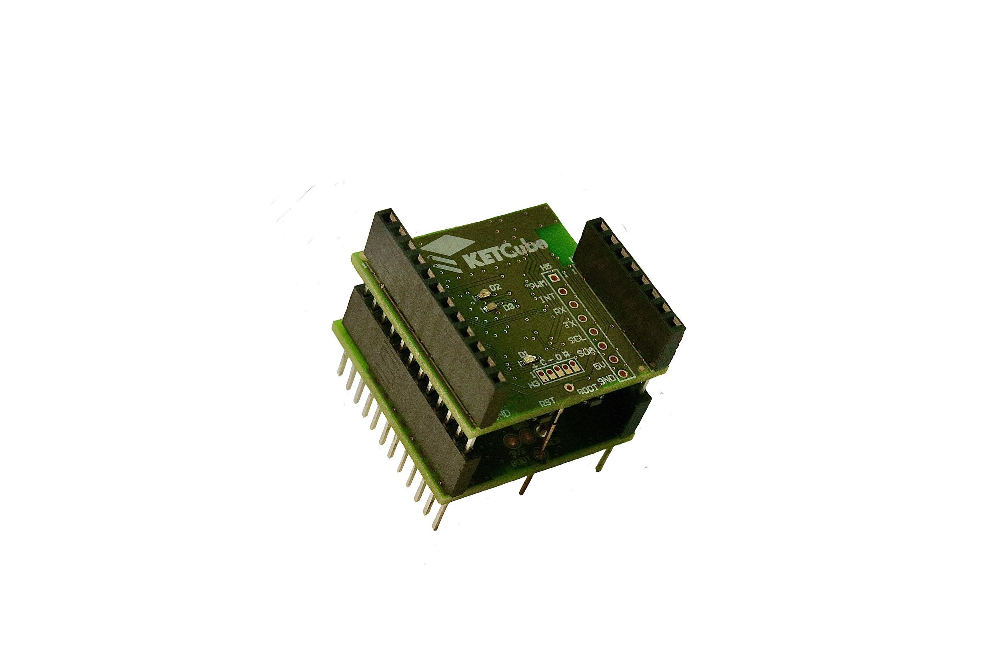

# KETCube EDU

KETCube® je moderní vývojová platforma pro IoT, která byla vyvinuta na [Fakultě elektrotechnické](https://fel.zcu.cz) [Západočeské univerzity v Plzni](https://www.zcu.cz), je licencována jako tzv. Open Source Hardware, čili ji může používat úplně každý. Díky svým vlastnostem, modernímu designu, univerzálnosti, nízké spotřebě, možnosti přímé komunikace do IoT sítí (LoRaWAN a Sigfox) a cenové dostupnosti si našla uplatnění i v průmyslových aplikacích.

Nyní se ve formě edukačního balíčku nazvaného “KETCube EDU” pro [Arduino](https://www.arduino.cc) dostává do rukou široké veřejnosti a školám, a to díky integraci KETCube® do globálně užívaného vývojového prostředí [Arduino IDE](https://www.arduino.cc/en/software). To znamená, že i programátor začátečník může začít ve svých prvních projektech platformu KETCube® plně využívat.

## Začínáme s KETCube EDU
  * [Seznámení s KETCube](pages/intro.md)
  * [Základní sada KETCube EDU](pages/set_basic.md)
  * [Postup instalace krok za krokem](pages/install.md)
  * [Připojení KETCube k počítači](pages/connect.md)
  * [Kompilace a nahrání kódu do KETCube](pages/compile.md)
  * [Nastavení KETCube](pages/settings.md)
  * [Nastavení LoRaWAN v KETCube](pages/lorawan.md)

## Příklady
  * [Blikání LED na desce KETCube](pages/example_onBoardLED.md)
  * [Příklad s tlačítkem - obsluha přerušení](pages/example_buttonLED.md)
  * [Čtení analogové hodnoty](pages/example_analogRead.md)
  * [Senzor teploty a LoRaWAN](pages/example_tempSensor.md)
  * [Ovládání KETCube přes LoRaWAN](pages/example_remoteControl.md)

## Licence

KETCube® i KETCube EDU je poskytován zdarma Západočeskou univerzitou v Plzni za podmínek uvedených v [LICENCI](LICENSE.md).

KETCube® je registrovaná ochranná známka Západočeské univerzity v Plzni.

KETCube EDU pro Arduino vznikl jako projekt ZČU v Plzni za podpory města [Plzeň](https://www.plzen.eu) v rámci projektu **Plzeň univerzitní město 2020**

