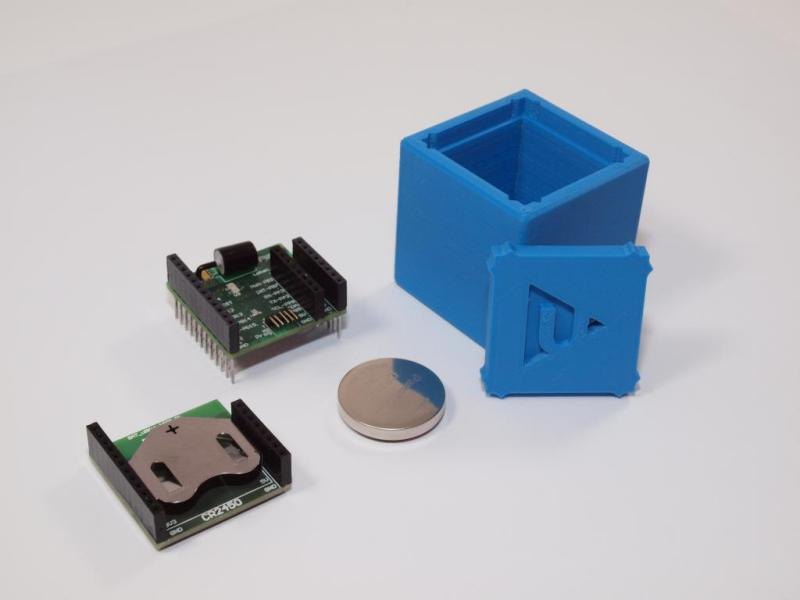

# KETCube EDU

Edukační balíček pro [Arduino](https://www.arduino.cc).

## Příklady
  * [Blikání LED na desce KETCube](pages/example_onBoardLED.md)

## Licence

KETCube i KETCube EDU je poskytován zdarma Západočeskou univerzitou v Plzni za podmínek uvedených v [LICENCI](LICENSE.md).

KETCube je registrovaná ochranná známka Západočeské univerzity v Plzni.

