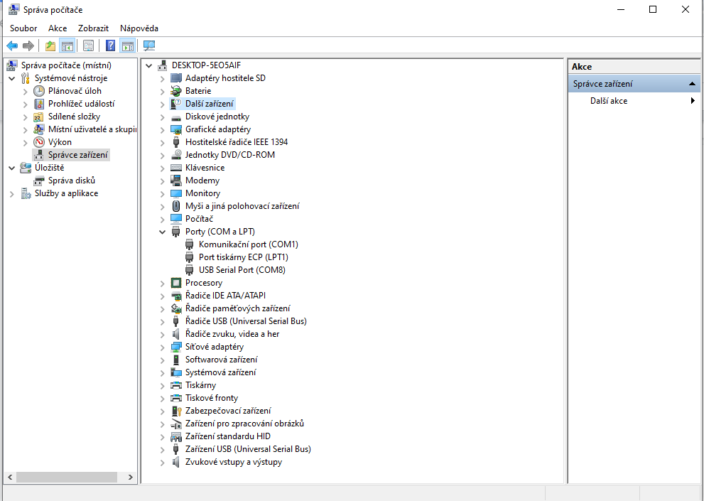
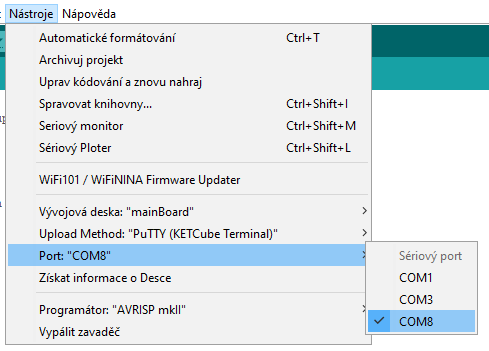
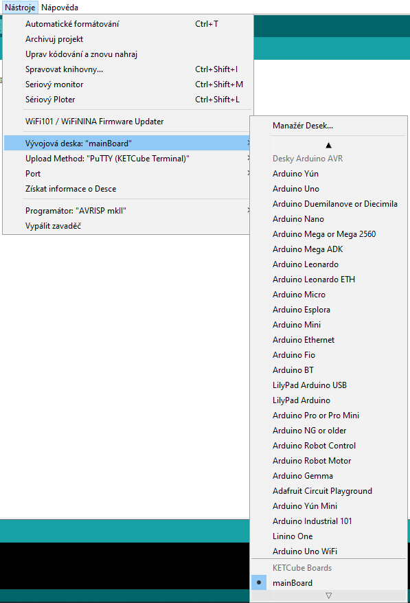

# Připojení KETCube k počítači

KETCube připojte k PC: zapojte Micro USB kabel do desky KETCube UART.

Pro komunikaci je třeba označit port, ke kterému je naše zařízení připojeno. Napoví vám stisk pravého tlačítka na ikoně na ploše počítače **Tento počítač** a volba **Spravovat**.

V menu vlevo vyberte **Správce zařízení** a vpravo pak rozklikněte položku **Porty** a u položky USB Serial Port najděte číslo portu, které následně zvolíte v menu programu Arduino IDE **Nástroje / Port**.

---
**Poznámka**

Na daném portu může komunikovat pouze jeden program. Proto je třeba např. ukončit Putty před spuštění nahrávání kódu do KETCube.

---

Nyní v menu Nástroje / Vývojová deska zvolte desku **KETCube Boards / mainBoard**

