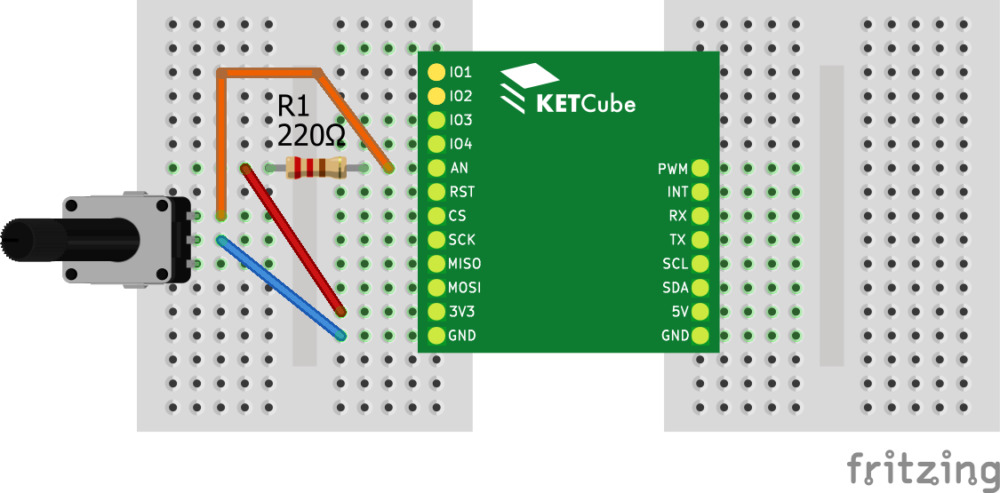

# Čtení analogové hodnoty

V tomto příkladu se naučíte číst analogové hodnoty. 

Pokud jste ještě nepracovali s Terminálem a LED diodami, podívejte se nejprve na příklad [Blikání LED na desce KETCube](example_onBoardLED.md)

Nastavení KETCube je totožné jako v příkladu [Blikání LED na desce KETCube](example_onBoardLED.md)

## Zapojení desky

Potřebné součástky: 10k potenciometr, pevný odpor 220R, spojené desky KETCube mainBoard a KETCube UART, Micro USB kabel, propojovací kabely typu samec-samec, nepájivé pole

Při zapojování postupujte takto:
  * krajní vývod potenciometru připojte k rezistoru 220R a zároveň k PINu AN na KETCube
  * druhý vývod rezistoru 220R připojte k PINu 3V3 na KETCube
  * prostřední vývod potenciometru připojte k PINu GND na KETCube
  * poté KETCube připojte k PC: zapojte Micro USB kabel do desky KETCube UART



## Programování a spuštění

Nahrajte následující kód do KETCube.

```c
void setup() {
  // Zobrazení zprávy v terminálu na začátku inicializace
  KETCube.Terminal.print("ADC @ KETCube");

  // Nastavení PINu AN - analogový vstup
  KETCube.IO.pinMode(AN, ANALOG);

  // Inicializace ADC
  KETCube.Analog.init();
}

void loop() {
  // Měření hodnoty napětí na potenciometru
  // a výpis hodnotu napětí
  KETCube.Terminal.print("U = %d mV", KETCube.Analog.read(AN));
}
```

Ve funkci *setup()* nastavujeme PIN AN jako analogový vstup, ale navíc musíme také nastavit převodník analogové hodnoty - ADC (Analog to Digital Converter) - to uděláme pomocí funkce *KETCube.Analog.init()*.

Voláním funkce *KETCube.Analog.read()* v každé periodě (ve funkci *loop()*) získáme okamžitou hodnotu napětí na PINu AN v milivoltech.

Po úspěšném překladu a nahrání kódu do KETCube otáčejte potenciometrem a sledujte měnící se hodnotu naměřeného napětí v Terminálu.
