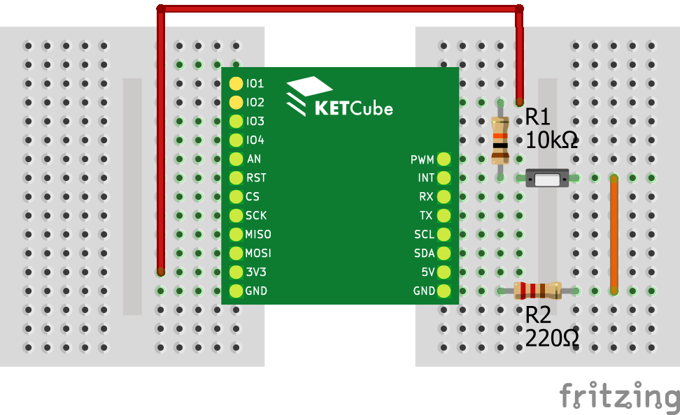

# Příklad s tlačítkem - obsluha přerušení

V tomto příkladu se naučíte obsluhovat přerušení. 

Pokud jste ještě nepracovali s Terminálem a LED diodami, podívejte se nejprve na příklad [Blikání LED na desce KETCube](example_onBoardLED.md)

Nastavení KETCube je totožné jako v příkladu [Blikání LED na desce KETCube](example_onBoardLED.md)

## Zapojení desky

Potřebné součástky: pevný odpor 10k, pevný odpor 220R, tlačítko, spojené desky KETCube mainBoard a KETCube UART, Micro USB kabel, propojovací kabely typu samec-samec, nepájivé pole

Při zapojování postupujte takto:
  * první vývod rezistoru 10k připojte k PINu 3V3 na KETCube
  * druhý vývod rezistoru 10k připojte k PINu INT na KETCube
  * k PINu INT na KETCube připojte také první vývod tlačítka
  * druhý vývod tlačítka připojte k prvnímu vývodu odporu 220R
  * druhý vývod odporu 220R připojte k PINu GND na KETCube
  * poté KETCube připojte k PC: zapojte Micro USB kabel do desky KETCube UART



## Programování a spuštění

Nahrajte následující kód do KETCube.

```c
// Klíčové slovo volatile upozorní překladač,
// aby neprováděl optimalizace přístupu k proměnné
// (proměnná může být změněna v jiném kontextu)
volatile bool buttonPushed = FALSE; 

// Funkce onPushButton se vykoná v kontextu přerušení
void onPushButton() {
  // v kontextu přerušení je vhodné vykonat pouze 
  // nejnutnější akce a rychle jej opustit 
  buttonPushed = TRUE;
}

// Funkce onPushButton se vykoná mimo kontext přerušení
void onExitHandler() {
  // Reakce na náběžnou hranu
  if ((buttonPushed == TRUE) && 
        (KETCube.IO.digitalRead(INT) == HIGH)) {
      // Pokud by přerušení bylo vyvoláno 
      // krátkým zákmitem (rušení), opětovné čtení
      // hodnoty PINu vliv zákmitu odfiltruje
      KETCube.LED.set(LED1, LED_ON);
      KETCube.LED.set(LED2, LED_OFF);
  // Reakce na spádovou hranu
  } else if ((buttonPushed == TRUE) && 
        (KETCube.IO.digitalRead(INT) == LOW)) {
      KETCube.LED.set(LED1, LED_OFF);
      KETCube.LED.set(LED2, LED_ON);
  }
}

void setup() {
  // Zobrazení zprávy v terminálu na začátku inicializace
  KETCube.Terminal.print("Preruseni @ KETCube");

  // Nastavení PINů LED1 a LED2 jako budičů LED
  KETCube.LED.init(LED1, HIGH);
  KETCube.LED.init(LED2, HIGH);
  
  KETCube.LED.set(LED1, LED_OFF);
  KETCube.LED.set(LED2, LED_OFF);

  // Nastavení interruptu na pinu INT
  KETCube.IO.pinMode(INT, IT_CHANGE);
  KETCube.IO.attachInterrupt(INT, &onPushButton);

  // Registrace funkce onExitHandler 
  // pro spuštění vždy po probuzení KETCube
  KETCube.Core.regSleepExitHandler(&onExitHandler);
}

void loop() {
  // V každé periodě: vypsání textu
  KETCube.Terminal.print("basePeriod @ KETCube");
}
```

Ve funkci *setup()* jednak nastavujeme PINy LED1 a LED2 jako LED diody, ale navíc nastavujeme také PIN *INT* jako zdroj přerušení. Přerušení se vyvolá při změně logické hodnoty na pinu (LOW -> HIGH nebo HIGH -> LOW).

Voláním funkce *KETCube.IO.attachInterrupt()* nastavíme obsluhu přerušení tak, že funkce *onPushButton()* se vykoná okamžitě po vyvolání přerušení - událost na PINu INT.

Navíc zaregistrujeme funkci *onExitHandler()* pomocí volání *KETCube.Core.regSleepExitHandler()*. Funkce *onExitHandler()* se pak vyvolá vždy, když KETCube opustí režim spánku. KETCube opustí režim spánku automaticky vždy po vyvolání přerušení.

Po úspěšném překladu a nahrání kódu do KETCube budou obě LED diody na desce reagovat na stisk tlačítka: stisknete-li tlačítko, rozsvítí se LED2, uvolníte-li jej, rozsvítí se LED1.

---
**POZNÁMKA**

Přímo v kontextu přerušení je vhodné vykonat pouze nejnutnější akce a rychle jej opustit, protože přerušení může nastat asynchronně a je vykonáno s vysokou prioritou - může tak v "nevhodnou dobu" přerušit vykonávání jiné části kódu. 

Nikdy v pŕerušení nepoužívejte aktivní čekání, nekonečné smyčky, apod..

Krátká a jednoduchá přerušení zvýší spolehlivost Vašeho kódu.

Kód vykonávaný ve funkci *onExitHandler()* je vykonán mimo kontext přerušení - s běžnou prioritou a nemůže tak vést k problémům v jiné ćásti kódu.

---
