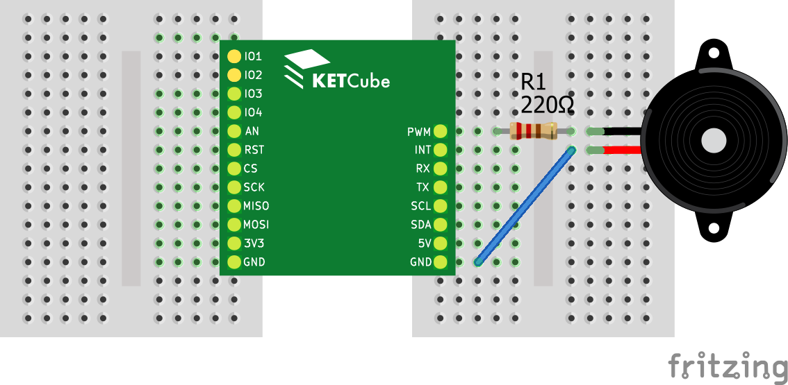

# Ovládání KETCube přes LoRaWAN

V tomto příkladu se naučíte pracovat s *downlink* zprávami v síti LoRaWAN a naprogramujete vzdálené ovládání periferií KETCube.

Pokud jste ještě nepracovali s Terminálem, podívejte se nejprve na příklad [Blikání LED na desce KETCube](example_onBoardLED.md). Základní pŕíklad práce s LoRaWAN naleznete v příkladu [Senzor teploty a LoRaWAN](example_tempSensor.md).

Základní nastavení KETCube je totožné jako v příkladu [Blikání LED na desce KETCube](example_onBoardLED.md), více se dozvíte v sekci [nastavení KETCube](settings.md). Podrobnosti k nastavení modulu LoRa v KETCube se dočtete v sekci [Nastavení LoRaWAN v KETCube](lorawan.md).

## Zapojení

Potřebné součástky: pevný odpor 220R, modul piezo bzučáku, spojené desky KETCube mainBoard a KETCube UART, Micro USB kabel, propojovací kabely typu samec-samec, nepájivé pole

Při zapojování postupujte takto:
  * první vývod rezistoru 220R připojte k PINu PWM na KETCube
  * druhý vývod rezistoru 220R připojte k prvnímu vývodu modulu piezo bzučáku
  * druhý vývod piezo bzučáku připojte k PINu GND na KETCube
  * poté KETCube připojte k PC: zapojte Micro USB kabel do desky KETCube UART



---
**TODO**

Je potřeba přidat link na popis konfigurace LoRa.

---

## Programování a spuštění

Nahrajte následující kód do KETCube.

```c
void onNewData(byte * buffer, byte len) {
  byte i;

  // Dekódování příkazu pro LED
  if (len > 0) {
    if (buffer[0] == 1) {
      KETCube.LED.set(LED1, LED_BLINK_SINGLE);
      KETCube.Terminal.print("LED1");
    } else if (buffer[0] == 2) {
      KETCube.LED.set(LED2, LED_BLINK_SINGLE);
      KETCube.Terminal.print("LED2");
    } else if (buffer[0] == 3) {
      KETCube.LED.set(LED1, LED_BLINK_SINGLE);
      KETCube.LED.set(LED2, LED_BLINK_SINGLE);
      KETCube.Terminal.print("LED1+LED2");
    }
  }

  // Nastavení přehrání zadaných tónů
  for (i = 1; i < len; i++) {
    // tóny jsou přijaty v jednotkách kHz
    // každý ton bude znít 300 ms,
    // následovat bude pauza 500ms
    KETCube.PWM.tone(buffer[i] * 1000, 300, 1000);
    KETCube.Terminal.print("Play: %d kHz", buffer[i]);
  }
}

void setup() {
  // Zobrazení zprávy v terminálu na začátku inicializace
  KETCube.Terminal.print("RemoteControl @ KETCube");

  // Nastavení LED1 a LED2
  KETCube.LED.init(LED1, HIGH);
  KETCube.LED.init(LED2, HIGH);
  KETCube.LED.set(LED1, LED_OFF);
  KETCube.LED.set(LED2, LED_OFF);

  // Inicializace PWM - PIN PWM
  KETCube.PWM.init();

  // Iniciallizace zpracování přijatých dat
  KETCube.LPWAN.regOnRxHandler(&onNewData);
}

void loop() {
  // žádný periodický kód
}
```

Oproti příkladu [Senzor teploty a LoRaWAN](example_tempSensor.md), je potřeba pro zpracování přijatých dat definovat a zaregistrovat (callback) funkci pro zpracování dat. V tomto příkladu se jedná o funkci *onNewData()*. Registraci funkce pro zpracování přijatých dat provedeme pomocí volání *KETCube.LPWAN.regOnRxHandler()* ve funkci *setup()*.

Funkce *onNewData()* má 2 parametry: odkaz (ukazatel) na pole přijatých dat a délku tohoto pole. Uvnitř funkce je provedeno dekódování a zpracování přijatých dat:
  * 1. byte přijatých dat je použit pro ovládání LED diod: 
    * je-li roven 1, problikne LED1
    * je-li roven 2, problikne LED2
    * je-li roven 3, probliknou obě diody
  * zbylé byty v poli představují frekvence pro generátor tónů: požadované tóny budou postupně přehrány pomocí funkce *tone()*

Po úspěšném překladu a nahrání kódu do KETCube připravte na serveru data k odeslání. Modul *Arduino* naslouchá na LoRaWAN portu 15.

## Nastavení KETCube

Váš kód funguje správně, ale data do sítě LoRaWAN zatím odesílána nejsou. To je způsobeno tím, že odesílání ze serveru směrem do zařízení je podmíněno pŕedchozím odesláním dat ze zařízení (LoRaWAN Class A). Váš modul ale neodesílá žádná data.

Aby KETCube začal odesílat data, povolte modul *HDCX080* - ten aktivuje senzor teploty a relativní vlhkosti (T+RH) na desce KETCube. V terminálu proveďte tyto příkazy:

```
>>
>> enable HDCX080 2
Executing command: enable
Command execution OK
>>
>> reload
Executing command: reload

```

Nyní sledujte výstup Vašeho kódu v Terminálu, pozorujte LED diody a poslouchejte generované tóny:

```
>>
HDCX080 :: Temperature: 22 °C, RH: 54 %
LoRa :: Transmitting sensor data: SUCCESS
LoRa :: Rx DATA=03-09-08-07-06-05-04-03-02 on PORT=15
Arduino :: LPWAN Rx (9)=03-09-08-07-06-05-04-03-02
Arduino :: LED1+LED2
Arduino :: Play: 9 kHz
Arduino :: Play: 8 kHz
Arduino :: Play: 7 kHz
Arduino :: Play: 6 kHz
Arduino :: Play: 5 kHz
Arduino :: Play: 4 kHz
Arduino :: Play: 3 kHz
Arduino :: Play: 2 kHz

```

Na terminálu vydíte:
  * výstup modulu *HDCX080*: výpis teploty a vlhkosti
  * Výpis modulu *LoRa*: 
    * informace o úspěšném odeslání dat 
    * informace o příjmu dat a výpis přijatých dat v HEX formátu
  * následuje výpis modulu *Arduino*:
    * informace o datech předaných modulem *LoRa* a jejich výpis v HEX formátu (není součástí Vaśeho kódu - tento výpis provádí knihovní funkce)
    * informace o nastavení LED diod
    * informace o frekvenci tónů naplánovaných k přehrátí: celkem vidíte 8 tónů s různou frekvencí
