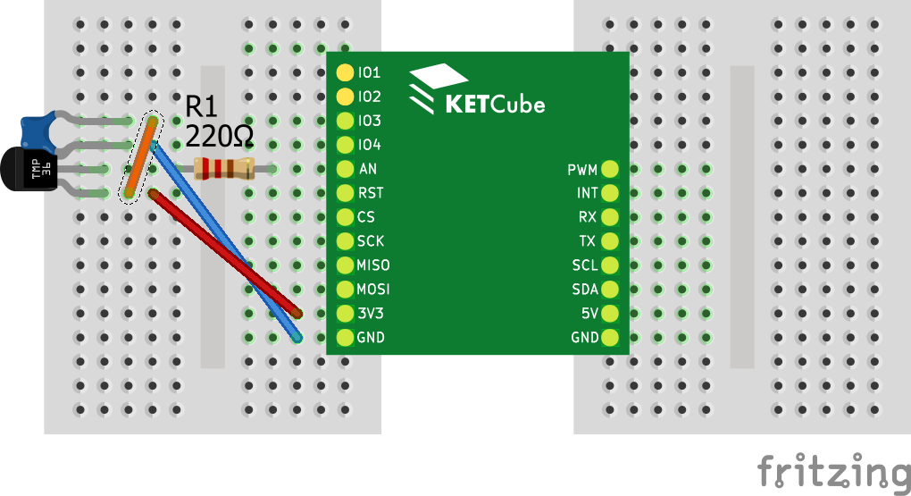

# Senzor teploty a LoRaWAN

V tomto příkladu se naučíte pracovat s jednoduchým senzorem teploty a odeslat naměřená data do sítě LoRaWAN. 

Pokud jste ještě nepracovali s Terminálem, podívejte se nejprve na příklad [Blikání LED na desce KETCube](example_onBoardLED.md). Úvod ke čtení analogové hodnoty naleznete v příkladu [Čtení analogové hodnoty](example_analogRead.md).

Základní nastavení KETCube je totožné jako v příkladu [Blikání LED na desce KETCube](example_onBoardLED.md)

## Zapojení desky

Potřebné součástky: pevný odpor 220R, kondenzátor 100n, teplotní senzor TMP36, spojené desky KETCube mainBoard a KETCube UART, Micro USB kabel, propojovací kabely typu samec-samec, nepájivé pole

Při zapojování postupujte takto:
  * první vývod rezistoru 220R připojte k PINu AN na KETCube
  * druhý vývod rezistoru 220R připojte k prostřednímu vývodu senzoru TMP36
  * k napájecímu PINu TMP36 připojte první vývod kondenzátoru 100n a PIN 3V3 na KETCube
  * k zemnímu PINu TMP36 připojte druhý vývod kondenzátoru 100n a PIN GND na KETCube
  * poté KETCube připojte k PC: zapojte Micro USB kabel do desky KETCube UART



---
**POZNÁMKA**

Detailní informace k senzoru teploty TMP36 získáte v [datovém listu](../files/datasheet/TMP35_36_37-1504323.pdf), kde se dozvíte, mimo jiné, o dalších možnostech jeho zapojení.

---

## Programování a spuštění

Nahrajte následující kód do KETCube.

```c
#define SENSOR_OFFSET  500 // Offset je 500mV
#define SENSOR_SCALING  10 // Rozlišení je 10mV/C

uint8_t buffer[2]; // pole pro předání hodnot modulu LoRa

void setup() {
  // Zobrazení zprávy v terminálu na začátku inicializace
  KETCube.Terminal.print("TempSensor @ KETCube");

  // Nastaví PIN AN jako analogový vstup
  KETCube.IO.pinMode(AN, ANALOG);

  // Inicializuje ADC
  KETCube.Analog.init();
}

void loop() {
  uint16_t mv;
  int16_t temp;
  
  // Měření hodnoty napětí na výstupu senzoru
  mv = KETCube.Analog.read(AN);
  
  // Výpis hodnoty napětí
  KETCube.Terminal.print("U = %d mV", mv);

  // Přepočet hodnoty napětí na teplotu
  temp = (((int16_t) mv) - SENSOR_OFFSET) / SENSOR_SCALING;

  // Výpis naměřené teploty
  KETCube.Terminal.print("T = %d C", temp);

  // Odeslání dat do sítě LoRaWAN
  buffer[0] = (byte) ((temp >> 8) & 0xFF);
  buffer[1] = (byte) (temp & 0xFF);
  KETCube.LPWAN.send(buffer, 2);
}
```

Oproti příkladu [Čtení analogové hodnoty](example_analogRead.md), kde voláním funkce *KETCube.Analog.read()* v každé periodě (ve funkci *loop()*) pouze zjišťujeme hodnotu napětí na vstupu KETCube, zde můžeme přepočtením této hodnoty získat teplotu naměřenou senzorem TMP36.

Poslední 3 řádky kódu slouží k předání naměřených hodnot modulu LoRa k odeslání do IoT sítě LoRaWAN. Hodnoty jsou po bytech uloženy do globálního pole v pořadí od nejvýznamnějších bytů (MSB-first) a odkaz na data je předán pomocí funkce *KETCube.LPWAN.send()*.

---
**POZNÁMKA**

Pro předání naměřených dat použijte globální proměnnou (pole *buffer*), lokální datové struktury se alokují na tzv. zásobníku (*stack*) a po opuštění funkce *loop()* může být jimi obsazená paměť použita pro jiný účel - mohli byste tak o naměřená data přijít - data by byla přepsána jinými proměnnými využívajícími zásobník.

---

Po úspěšném překladu a nahrání kódu do KETCube sledujte hodnotu naměřeného napětí a teploty v Terminálu.

## Nastavení KETCube

Váš kód funguje správně a měření teploty probíhá, ale data do sítě LoRaWAN zatím odesílána nejsou.

Aby se tak stalo, proveďte v terminálu tyto příkazy:

```
>>
>> enable LoRa 2
Executing command: enable
Command execution OK
>>
>> set core basePeriod 120000
Executing command: basePeriod
Command execution OK
basePeriod returned: 120000
>>
>> reload
Executing command: reload

```

Nyní je modul *LoRa* povolen a naměřená data budou odeslána s periodou 2 minuty. Máte-li správně nakonfigurované zařízení KETCube i síťový LoRaWAN server, Vaše data budou odeslána a budete je moci vizualizovat ve webovém rozhraní.

```

Performing system reset and reloading KETCube configuration ...


Welcome to KETCube Command-line Interface
-----------------------------------------
Version: 0.2-dev (build: 121bf76)

Use [TAB] key to show build-in help for current command
Use [ENTER] key to execute current command
Use [+]/[-] keys to browse command history

List of commands:
        about   Print ABOUT information: Copyright, License, ...
        help    Print HELP
        disable Disable KETCube module
        enable  Enable KETCube module
        list    List available KETCube modules
        reload  Reload KETCube
        show    Show LoRa, SigFox ... parameters
        showr   Show LoRa, SigFox ... RUNNING parameters
        set     Set LoRa, SigFox ... parameters
        setr    Set LoRa, SigFox ... RUNNING parameters

--- "core" Init() START ---
KETCube core base period set to: 120000 ms
KETCube start delay set to: 25000 ms
KETCube core severity level: INFO
KETCube driver severity level: NONE
--- "core" Init() END ---

--- "LoRa" Init() START ---
Module severity level: INFO
LoRa :: LoRaWAN SPEC version: 1.0.3
LoRa :: Device class A
LoRa :: OTAA Mode enabled
LoRa :: devEUI=37-30-36-30-7B-39-84-06
LoRa :: appEUI=00-00-00-00-00-00-00-00
LoRa :: appKey=00-00-00-00-00-00-00-00-00-00-00-00-00-00-00-00
--- "LoRa" Init() END ---

--- "Arduino" Init() START ---
Module severity level: INFO
Arduino :: TempSensor @ KETCube
--- "Arduino" Init() END ---


```

Je-li vše nastaveno správně, pak po úspěšném připojení do sítě LoRaWAN uvidíte v Terminálu výpis podobný tomuto:

```
>>
LoRa :: Not joined
LoRa :: NetID: 0x916019
LoRa :: DevAddr: 0x3314FC05
LoRa :: Datarate: DR_0
LoRa :: CFList :: New Freq: 867100000 Hz
LoRa :: CFList :: New Freq: 867300000 Hz
LoRa :: CFList :: New Freq: 867500000 Hz
LoRa :: CFList :: New Freq: 867700000 Hz
LoRa :: CFList :: New Freq: 867900000 Hz
LoRa :: Joined
>>
Arduino :: U = 735 mV
Arduino :: T = 23 C
LoRa :: Transmitting sensor data: SUCCESS
>>
```
