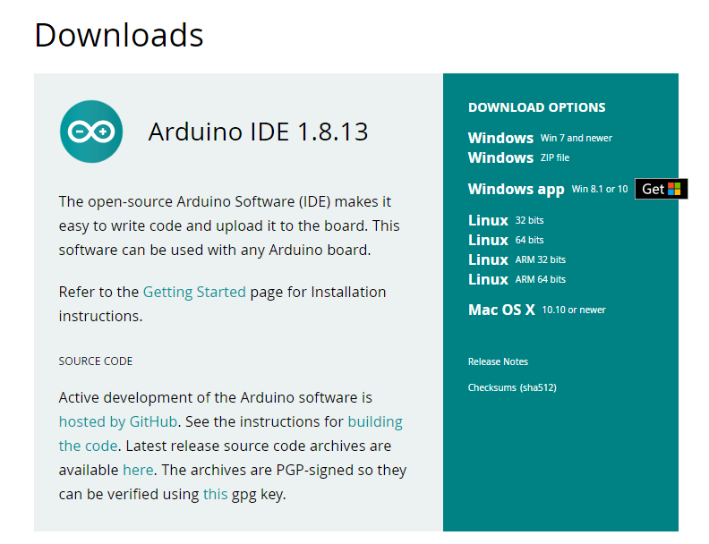
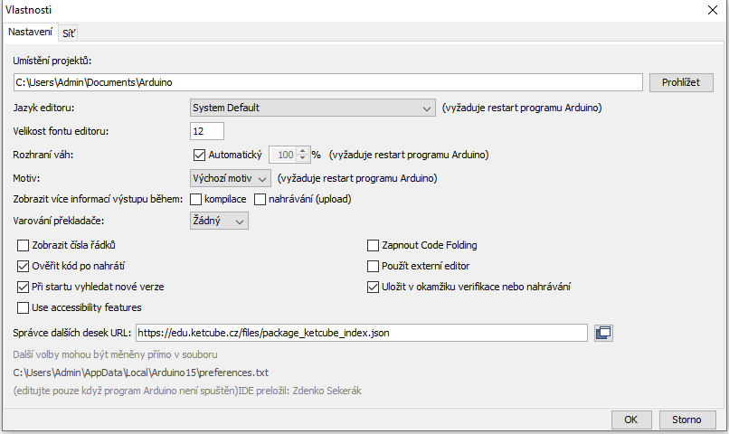
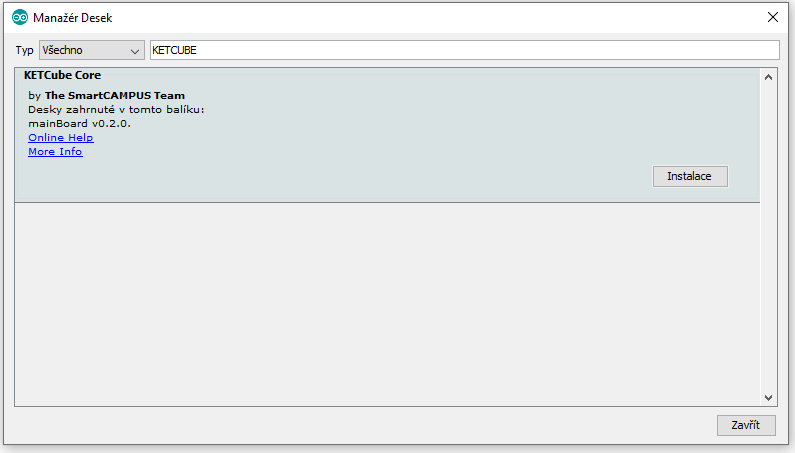
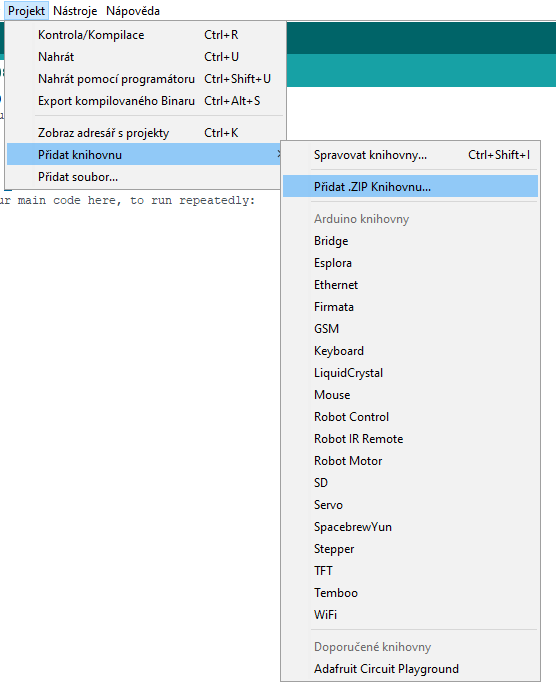

# Postup instalace krok za krokem

Než začnete, je zapotřebí do Vašeho počítače nahrát potřebný software. Vše potřebné vysvětluje právě tato kapitola.

## Instalace potřebného software

K práci edukačním kitem budete potřebovat SW Arduino IDE. Stáhněte si jej ze stránky [https://www.arduino.cc/en/software](https://www.arduino.cc/en/software). Zvolte svou verzi OS a SW nainstalujte pomocí průvodce instalací.



## Instalace balíčku KETCube EDU

Pro práci je třeba říci programu Arduino IDE, kde najde informace o naší desce. V menu **Soubor / Vlastnosti** do řádky “Správce dalších desek URL:” vložte cestu [https://edu.ketcube.cz/files/package_ketcube_index.json](https://edu.ketcube.cz/files/package_ketcube_index.json) a potvrďte tlačítkem **OK**.



Instalaci desky proveďte v menu **Nástroje / Vývojová deska / Manažer desek**. Vyhledejte ze seznamu naší esku KETCube a stiskněte tlačítko **Instalace**



## Instalace balíčku s příklady pro KETCube EDU

Nejprve stáhněte aktuální balíček z webu KETCube EDU kliknutím na odkaz **Stáhnout Příklady** v hlavní nabídce.

Balíček příkladů lze vložit v menu **Projekt / Přidat knihovnu / Přidat .ZIP Knihovnu...** a zvolte soubor s archivem příkladů. 



Příklady pak najdete v menu **Soubor / Příklady**

---
**Poznámka**

Provádíte-li aktualizaci nebo chcete-li přeinstalovat balíček s příklady pro KETCube EDU, Arduino IDE Vám při pokusu o instalaci oznámí: *Knihovna s názvem KETCube-Arduino-lib již existuje*
Soubory knihovny je bohužel nutné nejprve manuaĺně odstranit, aktualizace z Arduino IDE není bohužel možná. 

Umístění souborů knihovny se může lišit v závislosti na Vašem nastavení a verzi Arduino IDE. Pro odstranění starší verze knihovny smažte celý adresář **KETCube-Arduino-lib** z knihoven Arduino IDE.

Typické umístění knihoven v operačním systému Windows:
  * c:\Users\USERNAME\Dokumenty\Arduino\libraries

Typické umístění knihoven v Unixových operačních systémech:
  * ~/Arduino/libraries


---
**Instalace v GNU/Linuxu**

Většina distribucí GNU Linuxu zahrnuje balíček Arduino IDE v repozitářích. Pro práci s KETCube terminálem nainstalujte také program PuTTY.

Instalace Arduino IDE a závislostí ve Fedoře:
```bash
$ sudo dnf install arduino putty
```

Instalace Arduino IDE a závislostí v Ubuntu:
```bash
$ sudo apt-get install arduino putty
```

---
