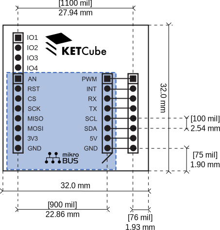

# Seznámení s KETCube

KETCube® je prototypová a demo platforma vyvinutá na Katedře materiálů a technologií (KET), Elektrotechnické fakulty Západočeské univerzity v Plzni. Podrobné informace lze nalézt v datasheetu KETCube, který lze stáhnout z webu KETCube EDU.
Platforma KETCube se skládá z hlavní desky a rozšiřujících desek. Tyto desky lze stohovat, aby se dosáhlo zamýšlené funkce. Má implementován základní autonomní RHT (relativní vlhkost a teplota) senzor, jehož funkčnost je podmíněna pouze stohováním hlavní a bateriové desky (nebo jiným způsobem napájení hlavní desky).
Další senzory lze připojit k základní desce připojením k pinům na pinové liště. Základní deska je osazena mikroBUSTM pinout-kompatibilní pinovou lištou.

KETCube pracuje s napájecím napětím a napětím logiky 3,3V. Pro napájení desky lze použít napětí 3,3V nebo 5V.

## Hlavní parametryPodporované frekvence: 868MHz, 915MHz
  * Podporované bezdrátové komunikační protokoly: LoRaWAN, Sigfox (plánováno), proprietární P2P (experimentální)
  * Rozhraní: UART, SPI, I2C, ADC, DAC, PWM, INT, GPIO
  * Pinout KETCube je kompatibilní s pinoutem mikroBUSTM
  * Klíčové obvody: Murata Type ABZ (CMWX1ZZABZ), TI HDC2080

## Pinová Patice
Patice KETCube je nadmnožinou definované zásuvky mikroBUS od MikroElektronika d.o.o. 

Pinout KETCube byl definován kvůli nedostatku pinů dostupných v pinoutu mikroBUSTM a kvůli omezující velikosti mikroBUSTM samostatně (např. podle velikosti baterie). Podrobný pohled na oba pinouty je na obrázku.

Pinout KETCube rozšiřuje pinout mikroBUSTM o další 4 IO piny do pinové lišty označené IO1 - IO4 (viz. obrázek). Kratší pinová lišta je duplikována při zachování rozložení pinů a zvýšení vzdálenosti patic z 22,86 mm = 0,9" pro mikroBUSTM na 27,94 mm = 1,1".

Protože pinová lišta KETCube je nadmnožinou mikroBUSTM, obě zásuvky lze umístit na stejnou desku a povolit obojí (mikroBUSTM i KETCube) připojení modulu. Pokud jsou osazeny průchozí pinové lišty, KETCube pinout umožňuje (téměř) neomezené stohování KETCube pinout-kompatibilních desek.

## Hlavní deska KETCube (KETCube mainBoard)
Hlavní deska KETCube je základní součástí platformy KETCube. Je vybavena pinovými lištami (mikroBUSTM / KETCube) umožňujícími připojení desky kompatibilní s mikroBUSTM a KETCube pinoutem.

Procesor hlavní desky je STM32L0 integrovaný do modulu Murata Type ABZ. Některé z pinů STM32L082 jsou k dispozici na desce a na pinových lištách, některé z nich jsou určeny pro rádio typu ABZ, a proto je nemůže používat aplikace.
Hlavní deska je vybavena snímačem HDC2080 RHT, který může sloužit k monitorování relativní vlhkosti (RH) a teploty (T).
Deska může být osazena integrovanou anténou nebo některým z anténních konektorů (u.FL, SMA) pro připojení externí antény.

## Terminál KETCube
Pokud obsahuje KETCube dodávaný firmware, lze použít pro komunikaci s KETCube a jeho konfiguraci prostředí sériové komunikace s názvem KETCube Terminal. Ten je k dispozici na rozhraní USART1 (IO1 a IO2)

Terminál KETCube umožňuje konfigurovat moduly KETCube (LoRa, HDCX080, batMeas ...) a parametry modulu (např. devEUI, appKey, ... pro modul LoRa). Terminál KETCube je citlivý na velká písmena.

Příkazy terminálu se řídí hierarchickým stromovým uspořádáním. Po resetování zařízení se vytiskne základní nápověda včetně kořenových/základních příkazů. Nápovědu lze kdykoli vyvolat příkazem help.
Po stisknutí klávesy [TAB] se zobrazí vložená nápověda (např. Napište „s [TAB]“ a všechny příkazy začínající „s“ budou vytištěny - jsou to: „set“ a "show"). Inline nápověda je užitečná zejména pro příkazy skryté hluboko ve stromové struktuře.
Chcete-li zobrazit seznam modulů, použijte příkaz list. Příkazy enable (povolit) / disable (zakázat) slouží k zapnutí / vypnutí modulů KETCube.

Když je modul povolen, začne provádět definovanou operaci (např. změřte RH a teplotu a odešlete výsledky přes LoRa).
K ladění lze dodatečně použít povolovací příkaz a druhý (volitelný) parametr příkazu, který nastavuje úroveň severity modulu (bez použití druhého parametru zůstává severita nezměněné úrovni).
Úrovně severity jsou: NONE (0), ERROR (1), INFO (2) a DEBUG (3). Úroveň severity definuje množství informací poskytnutých zadaným modulem do rozhraní terminálu. Výchozí úroveň severity je ERROR.
Příkazy show / set se používají k zobrazení / nastavení parametrů modulů KETCube (např. show LoRa devEUI). Parametry se ukládají do EEPROM na čipu. 

Historie příkazů je dostupná pomocí kláves > a <.
Všechna nastavení, kromě těch nastavených příkazem setr, se použijí po resetu zařízení. Ten proveďte příkazem reload.

Příkaz setr slouží ke změně (některých) parametrů za běhu.

Práce v Terminálu je popsána dále.

### Výchozí nastavení terminálu:
Tx PIN: IO2
Rx PIN: IO1
Rychlost: 9600 b/s
Datové bity: 8
Stop bity: 1
Parita: Ne
HW Flow control: Ne
Konec řádku: CR + LF nebo LF

